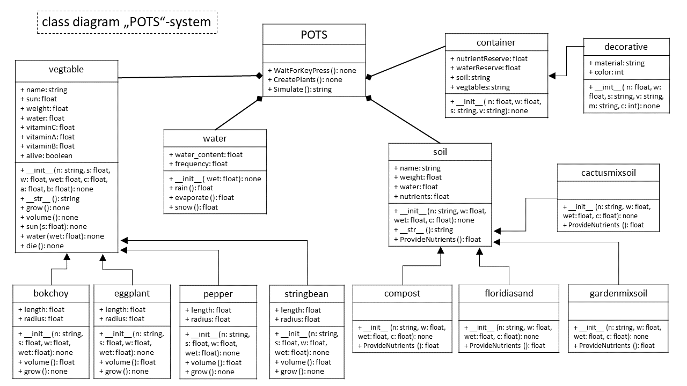

## **P**ortable **O**rganic **T**rouble-free **S**elf-watering System (**POTS**) Model
The POTS-System is consisting out of 4 main types of components. A POTS system can be of different vegetables, containers, water and soil. The overall structure is ilustrated as follows:

## object diagram (POTS-system)

## class diagram (POTS-system)

