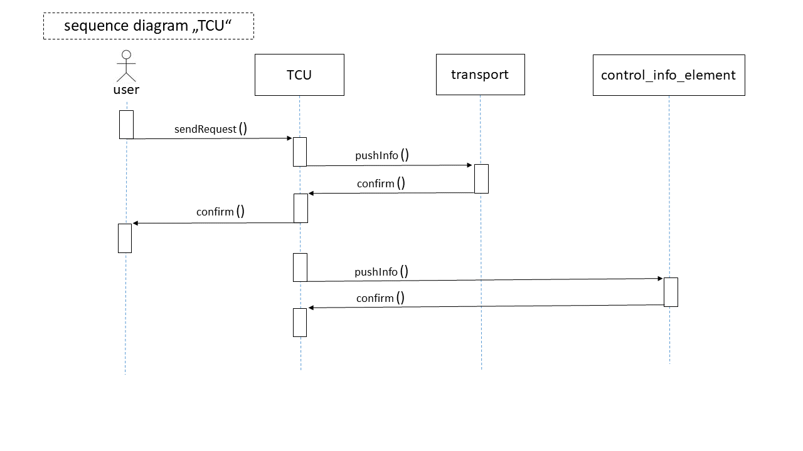

## Smart City (My Problem) Model - Sequence Diagram

Due to the fact that the described system is mainly consisting out of management and informational commands,
I decided to illustrate a sequence diagram as my behavioral diagram to show the ways of communication.

