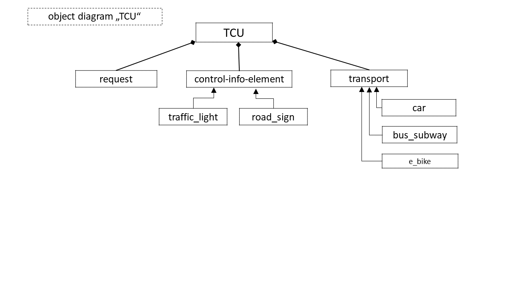

## Smart City (My Problem) Model - Object Diagram

This diagram is representing a rough overview of the involved components of my Traffic-control-unit that should lead to the situation where a city is able to use ALL their transportation-ressources efficient. 

